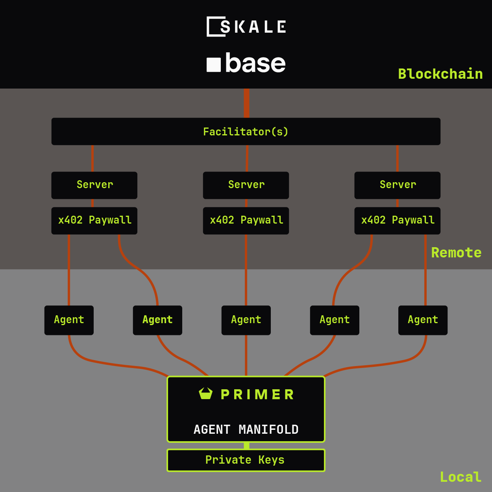
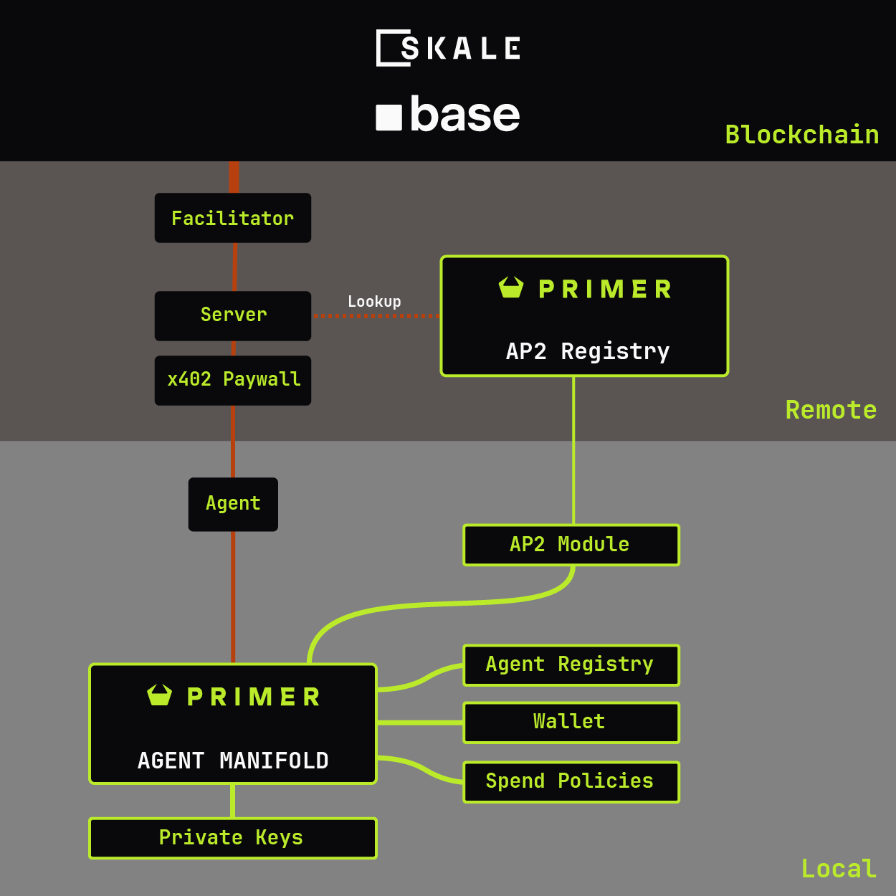

# The Agent Manifold

**A desktop x402 payment manager for AI agents.**

Delegate spending authority to agents without sharing private keys. Implements the full AP2 flow: intent, authorization, settlement, and receipt. Accepts direct A2A x402 as well as HTTP x402.



## The Problem

AI agents need to pay for things, but giving an agent your private key is dangerous as too many recent examples show. No amount of persuasion is guaranteed to convince a free-willed agent to behave as you ask. The Agent Manifold sits between your agents and your wallet, enforcing spending policies and requiring human approval when needed.

## How It Works

```
Agent hits paywall → 402 + Payment-Required header
                            ↓
              Agent calls POST /sign with header
                            ↓
         Manifold checks policy (daily limit, domain, etc.)
                            ↓
        Auto-approve OR human approval dialog in app
                            ↓
              Manifold signs EIP-712 authorization
                            ↓
         Agent retries request with payment header
                            ↓
            Merchant settles via x402 Facilitator
                            ↓
         Agent reports settlement via POST /callback
                            ↓
              Manifold verifies on-chain, stores receipt
```

Any agent framework can integrate via HTTP to `localhost:9402`. Bearer tokens for simplicity, HMAC-SHA256 for production security.

## Authorization Controls

- **Spend Policies** — Daily limits, per-request caps, auto-approve thresholds
- **Domain Restrictions** — Allowlist/blocklist which merchants can receive payments
- **Agent Isolation** — Each agent gets unique credentials, cannot access other agents' budgets
- **Human Approval** — Payments above threshold trigger a dialog in the app
- **AP2 Intent Mandates** — Signed VDCs document authorization, publishable to AP2 registry for merchant verification

## Accountability

Every transaction is logged with agent, amount, domain, timestamp, and on-chain tx_hash. Settled payments are verified against the blockchain. AP2-formatted receipts are available via `/receipt/{id}`.

Intent Mandates document who authorized what - signed with your wallet key, publishable to the AP2 registry, verifiable by merchants.



## Technical Details

- **Wallet Security:** AES-256-GCM encryption, Argon2id key derivation (64MB, 3 iterations)
- **Payment Signing:** EIP-712 structured data, EIP-3009 `transferWithAuthorization`
- **Networks:** SKALE Base, SKALE Base Sepolia, Base, Base Sepolia
- **Protocol Support:** v1/v2 HTTP x402 and A2A x402 (direct JSON payloads)
- **Auth Modes:** Bearer tokens (simple) or HMAC-SHA256 (production)

## Demo

**Video:** [Watch the demo →](https://www.youtube.com/watch?v=51P_oOkBdQA)

The demo shows the full payment flow from agent request to on-chain settlement, including a failure case where a payment limit is exceeded and the agent is forced to consider a new choice.

## Download

**[Download Primer.exe →](https://github.com/primer-systems/agent-manifold/releases)**

Or run from source:
```bash
pip install -r requirements.txt
python src/app.py
```

## Links

- [Full Documentation](https://docs.primer.systems/agent-manifold.html)
- [AP2 Registry](https://ap2.primer.systems)
- [Test Paywall Builder](https://www.primer.systems/test-paywall)
- [Medium Article](https://medium.com/@primersystems/the-x402-agent-manifold-d51e72ee029d)

